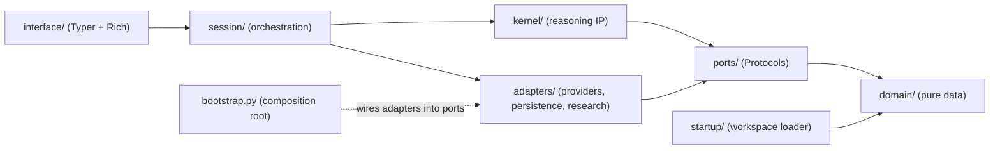
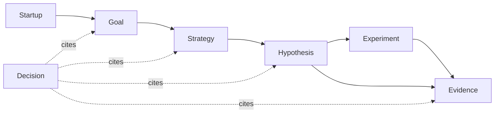
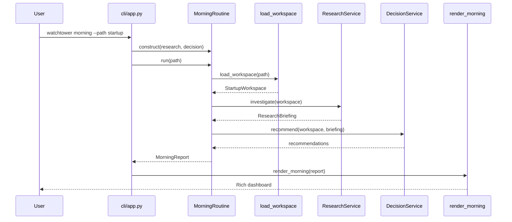

# Watchtower Architecture

Watchtower is a **local-first AI Founder Operating System**, delivered as an
internal command-line tool. It loads a founder's living understanding of their
startup from local files, and — eventually — performs research and produces
recommendations on top of that context. It is not a SaaS product: everything
runs on the founder's machine.

> **Maintenance note:** This document is the source of truth for Watchtower's
> architecture. Update it in the same change whenever the system architecture,
> domain model, request lifecycle, extension points, or integration points
> change.

---

## 1. Overall system architecture

Watchtower follows a layered, ports-and-adapters (hexagonal) style. Dependencies
point **inward** toward a pure domain that knows nothing about frameworks, I/O,
or LLMs. Outer layers depend on inner layers, never the reverse.



Dependencies point **inward**: every arrow ends at a ring that knows nothing
about the ring it came from. `adapters` implement `ports`; `bootstrap` is the one
place that constructs concrete adapters and wires them to the ports the kernel
consumes.

### Rings and ownership

| Ring | Path | Own / Rent | Responsibility |
|------|------|-----------|----------------|
| 0 — Domain | [domain/](watchtower/domain) | **OWN** | Pure, immutable data (stdlib only): beliefs, decisions, inquiry, judgment, messages. |
| 1 — Ports | [ports/](watchtower/ports) | **OWN** | `Protocol` seams: `Oracle`, `BeliefStore`/`DecisionStore`, `ResearchProvider`, `Clock`, `ContextProvider`. Import domain only. |
| 2 — Kernel | [kernel/](watchtower/kernel) | **OWN** | The intellectual property: single-pass reasoning, belief revision, decision ledger, inquiry convergence, and the system prompt. Imports domain + ports only. |
| 3 — Adapters | [adapters/](watchtower/adapters) | **RENT** | Replaceable implementations: LLM providers, JSON persistence, research. Implement ports. |
| 3 — Session | [session/](watchtower/session) | **OWN discipline** | Orchestration: the reasoning REPL and the end-of-session fold. Imports kernel + ports. |
| 4 — Interface | [interface/](watchtower/interface) | **RENT** | Human surface: the Typer CLI and Rich rendering. |
| — Workspace | [startup/](watchtower/startup) | **OWN schema** | Load a founder's local files into pure domain values. Imports domain only. |
| — Composition | [bootstrap.py](watchtower/bootstrap.py) | **OWN** | The only module that constructs concrete adapters and wires them to ports. |

### Final package tree

```
watchtower/
  domain/        beliefs · decisions · inquiry · judgment · messages
  ports/         oracle · stores · research · clock · context
  kernel/        reasoning · inquiry · prompt
    worldview/   revision · relevance · consolidation
    ledger/      capture · review · events
  adapters/
    providers/   openai · ollama · anthropic · gemini · factory · _retry · limits · _json · errors
    persistence/ json_beliefs · json_decisions · trajectory
    research/    gpt_researcher · placeholder · models
  session/       repl · fold
  interface/     cli · render · beliefs_view · decisions_view
  startup/       models · enums · workspace (loader)
  bootstrap.py   config.py   __main__.py
```

The key invariant: **inner rings never import outward**. It is enforced
automatically by [tests/test_architecture.py](tests/test_architecture.py) — the
kernel may not import an adapter, a provider SDK, a web/DB framework, a YAML
loader, or a UI toolkit, at import time or transitively — and that test is a
required CI check ([.github/workflows/ci.yml](.github/workflows/ci.yml)).

### The belief engine

Watchtower does not remember conversations — it remembers **conclusions**. Each
conversation is evidence; a second reasoning step ([beliefs/engine.py](watchtower/beliefs/engine.py))
turns that evidence into worldview updates (create / strengthen / weaken /
supersede / disprove / no-change, each with a rationale). Beliefs live behind a
storage-agnostic `BeliefStore` (JSON today; SQLite/Postgres later) and are never
silently overwritten — superseding links old to new, and every change is logged.
At the start of a turn, only the *relevant* beliefs (lexical overlap, no
embeddings) are injected as prior understanding the model may disagree with. The
feature is deliberately independent of embeddings, vector search, retrieval,
agents, and long-term conversation memory.

### The decision engine

Beliefs describe what Watchtower *thinks*; decisions describe what the founder
*chose to do* — a separate concept. A decision is captured
([decisions/engine.py](watchtower/decisions/engine.py)) only when the founder
**explicitly commits** to an action; it is never inferred from a recommendation.
Decisions link the beliefs that supported them (by id) but **never mutate
beliefs**, so the belief engine is untouched. They live behind a `DecisionStore`
with an append-only event log and stored reviews — prior reasoning is never
overwritten. A decision can later be `complete`d and `review`ed: the review
compares original assumptions and beliefs against current beliefs and observed
evidence to improve future judgment. The subsystem is independent of embeddings,
retrieval, and agents.

### The inquiry engine

Reasoning alone does not converge: the dialogue engine used to ask a
clarification, receive an answer, and — treating every turn as a fresh reasoning
pass — ask the same question again in different words. The fix is to model
clarifications as first-class **conversational state**. An `Inquiry`
([inquiry.py](watchtower/inquiry.py)) records the question, the uncertainty it
resolves, and its status (`open` / `answered` / `abandoned`) with the founder's
answer. Each turn, `think()` first decides whether the founder's latest message
answers the open inquiry; if so it is marked `answered`, its answer is fed back
into the reasoning, and it is never asked again. An unanswered inquiry may be
rephrased at most once (`_MAX_ASKS`) before it is `abandoned` and the engine is
forced to reason with what it has. Inquiries are neither beliefs nor decisions:
they live only within a conversation and are never persisted.

---

## 2. Domain model overview

The domain is a set of frozen dataclasses (`slots=True, kw_only=True`) using the
Python standard library only. Entities reference one another by strongly-typed
`NewType` identifiers rather than by composition, keeping the object graph flat,
storable, and cheap to update immutably.



| Entity | Purpose | Sourced from |
|--------|---------|--------------|
| `Startup` | Root identity: name, mission, stage. | `vision.md` |
| `Goal` | A measurable outcome. | `goals.yaml` |
| `Strategy` | An approach for reaching a goal. | `strategies.yaml` |
| `Hypothesis` | A testable belief a strategy relies on. | `hypotheses.yaml` |
| `Experiment` | A test that produces evidence about a hypothesis. | `experiments.yaml` |
| `Decision` | An append-only record of a choice made. | `decisions.yaml` |
| `Evidence` | An observation bearing on a hypothesis. | Not yet sourced; produced by future research/experiments. |

Lifecycle states are modeled as `StrEnum` values (see
[enums.py](watchtower/startup/enums.py)). The model carries no behavior — no
methods, validation logic, or persistence.

---

## 3. Request lifecycle: `watchtower morning`



1. **Parse.** Typer parses the `morning` command and its `--path` option
   (default `./startup`).
2. **Compose.** `app.morning` constructs a `GPTResearchService` and the
   placeholder `DecisionService` and injects them into a `MorningRoutine`.
3. **Load.** `MorningRoutine.run` calls the injected workspace loader.
   `vision.md` is required; every YAML file is optional and empty-safe. A
   `WorkspaceError` is raised for a missing directory/vision or malformed YAML.
4. **Research.** The routine asks the research service for a `ResearchBriefing`.
   `GPTResearchService` builds a query from the workspace (mission, goals,
   strategies, hypotheses) and runs GPT-Researcher via a `ResearchRunner`,
   returning structured findings. If GPT-Researcher is unavailable or fails, it
   degrades to the placeholder (flagged `is_placeholder=True`).
5. **Decide.** The routine asks the decision service for recommendations,
   derived from the workspace and briefing with transparent heuristics.
6. **Report & render.** The routine returns a `MorningReport`, which
   `render_morning` prints as a Rich dashboard. `WorkspaceError` is caught in
   the CLI and shown as a friendly message with exit code 1.

---

## 4. Extension points

| Seam | Interface | Swap in |
|------|-----------|---------|
| Workspace source | `WorkspaceLoader` callable | An alternate loader (e.g. remote or database-backed). |
| Research | `ResearchService` protocol | GPT-Researcher (implemented via `GPTResearchService`). |
| Research runner | `ResearchRunner` protocol | A different research backend behind `GPTResearchService`. |
| Decision | `DecisionService` protocol | LangGraph reasoning nodes. |
| Orchestration | `MorningRoutine` constructor injection | A compiled LangGraph graph. |
| Memory | `MemoryStore` protocol ([memory/store.py](watchtower/memory/store.py)) | mem0 / Graphiti-backed store. |
| Tools | [watchtower/tools/registry.py](watchtower/tools/registry.py) | Registered agent-callable tools. |
| LLM | [watchtower/llm.py](watchtower/llm.py) | Any OpenAI-compatible endpoint via config. |

**Adding a new workspace entity** involves: (1) adding/using a domain model in
[models.py](watchtower/startup/models.py), (2) a `_parse_*` function and a field
on `StartupWorkspace` in [workspace.py](watchtower/startup/workspace.py), and
(3) optionally a section in the dashboard.

---

## 5. Design decisions made so far

- **Local-first, not SaaS.** Watchtower runs on the founder's machine against
  local files; no server, no accounts.
- **Pure, stdlib-only domain.** Frozen dataclasses over Pydantic so the domain
  survives an orchestration-framework swap and has zero third-party coupling.
- **Reference by identity.** Entities link by `NewType` IDs, not nested objects,
  for a flat and storable graph.
- **Dependency injection via `Protocol`s.** Research and decision are ports;
  the CLI injects concrete services, with no change to the routine. Research is
  now GPT-Researcher-backed; decision is still a placeholder.
- **Honest placeholders and degradation.** When research runs on placeholder or
  degraded data it is flagged `is_placeholder=True`, and the decision heuristics
  surface a "wire in live research" recommendation while that flag is set.
- **GPT-Researcher is optional and degrades gracefully.** It is an optional
  dependency (`research` extra). If it is missing, unconfigured, or fails, the
  research service falls back to the placeholder, so `watchtower morning` always
  produces a briefing. Research runs behind an injectable `ResearchRunner` seam
  for testability.
- **Structured research, not markdown.** `GPTResearchService` maps research into
  typed fields (new evidence, competitor updates, scientific papers, market
  changes, confidence) rather than a markdown blob.
- **Graceful workspaces.** Only `vision.md` is required. Every YAML file is
  optional and empty-safe, so a founder can grow the workspace over time and the
  CLI keeps working at every stage.
- **`StrEnum` on Python 3.13.** Serialization-friendly string enums.
- **Tooling.** `uv` for dependencies, `ruff` for lint/format, `pytest` for tests.
- **No LangGraph or persistence yet.** Deliberately deferred behind the seams
  above; the decision service remains a placeholder.

---

## 6. Known limitations

- **Stateless.** Each run reloads from disk; there is no memory of prior
  mornings.
- **Decision-making is a placeholder.** Research is GPT-Researcher-backed, but
  the decision service is still deterministic heuristics.
- **Structured research is not yet rendered.** `new_evidence`, competitor
  updates, scientific papers, market changes, and the confidence score are
  produced and available on the briefing but not shown on the dashboard, which
  still renders `findings`.
- **Heuristic source classification.** GPT-Researcher sources are sorted into
  competitor / paper / market buckets by URL heuristics, not by an LLM.
- **No referential integrity.** IDs that cross-reference between YAML files
  (e.g. a strategy's `goal_id`) are not validated against one another.
- **Partial rendering.** The dashboard shows goals, hypotheses, research, and
  recommendations. Strategies, experiments, and decisions are loaded but not yet
  rendered.
- **No value-range validation.** `confidence` and `strength` are documented as
  `0.0`–`1.0` but not enforced.
- **Single workspace, synchronous.** One startup per invocation; no concurrency.
- **Naive local timestamps.** `generated_at` uses local, timezone-naive time.

---

## 7. Future integration points

| Technology | Role | Plugs into |
|------------|------|------------|
| **GPT-Researcher** | Autonomous web research producing briefings. | **Implemented:** `GPTResearchService` ([tools/research.py](watchtower/tools/research.py)), behind the `ResearchRunner` seam, degrading to the placeholder. |
| **Firecrawl** | Web crawling / scraping to feed research. | A tool under [watchtower/tools/](watchtower/tools) consumed by a `ResearchRunner`. |
| **LangGraph** | Stateful multi-step agent orchestration. | Replaces `MorningRoutine` with a compiled graph in [watchtower/graphs/](watchtower/graphs); decision steps become nodes implementing `DecisionService`. |
| **mem0** | Long-term founder/agent memory. | A `MemoryStore` implementation ([memory/store.py](watchtower/memory/store.py)) so routines recall prior context. |
| **Graphiti** | Temporal knowledge graph over the domain entities. | A memory/knowledge adapter under [watchtower/memory/](watchtower/memory) built from the domain graph. |

Each integration attaches at an existing seam, so adopting one should not
require changes to the domain model or the CLI surface.
