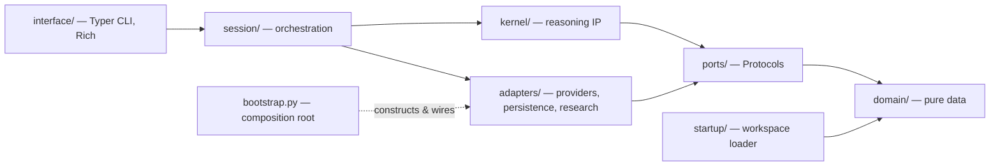
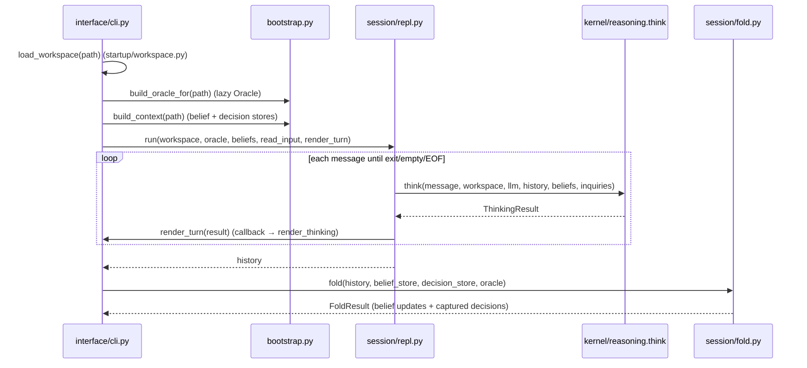
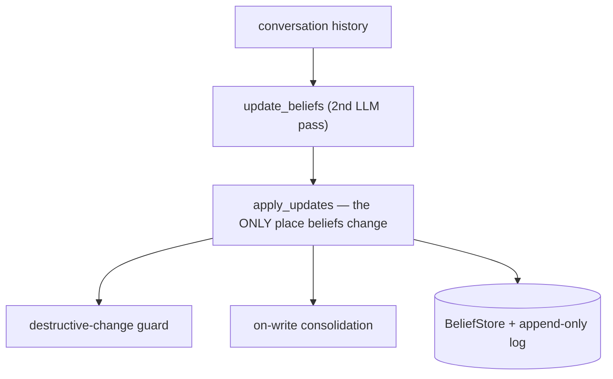

# Watchtower Architecture

> This document describes the architecture **exactly as implemented today**. It
> explains how the system is structured and how work flows through it. It is a
> reference, not a proposal. For the reasoning *behind* these choices, read
> [PHILOSOPHY.md](PHILOSOPHY.md). To change anything described here, write an ADR
> ([ADR_TEMPLATE.md](ADR_TEMPLATE.md)).

## 1. System overview

Watchtower is a local-first AI Founder Operating System delivered as an internal
command-line tool. A founder keeps their living context — vision, goals,
strategies, hypotheses — in local files. Watchtower reasons with them one turn at
a time, and, crucially, **learns**: every conversation is compiled into a durable
worldview of beliefs and decisions that persists across sessions.

The system is a **ports-and-adapters (hexagonal) architecture**. A pure reasoning
core — the *kernel* — sits at the centre and knows nothing about language-model
SDKs, files, the network, or the terminal. Everything mechanical is pushed to the
edges behind interfaces the kernel owns. Dependencies point strictly inward.

The architecture is organized into concentric rings:

```
domain → ports → kernel → adapters / session → interface
```

with two supporting modules that sit outside the rings: `startup/` (the workspace
loader) and `bootstrap.py` (the composition root).

## 2. Layer diagram



## 3. Dependency direction

There is exactly one rule, and everything else follows from it:

> **Dependencies point inward. An inner ring never imports an outer ring.**

Concretely:

- `domain` imports only the standard library.
- `ports` import only `domain`.
- `kernel` imports only `domain` and `ports`.
- `adapters` implement `ports`; they may import `domain` and `ports`.
- `session` imports `kernel`, `ports`, and (for the ephemeral transcript) the
  persistence adapter. It never imports `interface`.
- `interface` imports `session` and, for construction, `bootstrap`.
- `startup` imports only `domain`.
- `bootstrap` is the single module allowed to import concrete adapters and wire
  them to ports.

This rule is not a convention that relies on discipline. It is **enforced by an
automated fitness test** (see §12) that is a required CI check.

## 4. Responsibilities of each ring

| Ring | Path | Owns | Responsibility |
|------|------|------|----------------|
| 0 — Domain | `domain/` | **OWN** | Pure, immutable data: `Belief`, `Decision`, `Inquiry`, `ThinkingResult`, `Message`. Frozen dataclasses, `StrEnum`, `NewType` ids. No behaviour, no I/O. Standard library only. |
| 1 — Ports | `ports/` | **OWN** | `Protocol` seams the kernel reasons through: `Oracle`, `BeliefStore`, `DecisionStore`, `ResearchProvider`, `Clock`, `ContextProvider`. Import `domain` only. |
| 2 — Kernel | `kernel/` | **OWN** | The intellectual property: single-pass reasoning, belief revision, the decision ledger, inquiry convergence, and the system prompt. Imports `domain` and `ports` only. |
| 3 — Adapters | `adapters/` | **RENT** | Replaceable implementations of ports: LLM providers, JSON persistence, research. |
| 3 — Session | `session/` | **OWN discipline** | Orchestration: the interactive loop and the end-of-session fold. Depends on kernel and ports. |
| 4 — Interface | `interface/` | **RENT** | The human surface: the Typer CLI and Rich rendering. |
| — Workspace | `startup/` | **OWN schema** | Load the founder's local files into pure domain values. The only place YAML and the filesystem are read. |
| — Composition | `bootstrap.py` | **OWN** | The composition root: construct concrete adapters and hand them to the interface behind their ports. |

### The kernel, in detail

- `kernel/reasoning.py` — `think()`, one turn of typed reasoning.
- `kernel/inquiry.py` — the clarification finite-state machine helpers.
- `kernel/prompt.py` — the single system prompt, assembled from named sections.
- `kernel/worldview/` — `revision.py` (belief change), `relevance.py` (lexical
  selection), `consolidation.py` (on-write de-duplication).
- `kernel/ledger/` — `capture.py` (record decisions), `review.py` (complete and
  review), `events.py` (the event-sourced state algebra).

### The adapters, in detail

- `adapters/providers/` — `openai`, `ollama`, `anthropic`, `gemini`, a `factory`
  that selects one, plus `_retry`, `limits`, `_json`, and `errors`.
- `adapters/persistence/` — `json_beliefs`, `json_decisions`, `trajectory`.
- `adapters/research/` — `gpt_researcher`, `placeholder`, `models`.

## 5. The composition root

`bootstrap.py` is the **only** module that constructs concrete adapters. Nothing
above it names a provider class or a store implementation.

- `build_context(path)` returns an `AppContext` holding the two persistence
  adapters the CLI always needs (`belief_store`, `decision_store`), behind their
  ports.
- `build_oracle_for(path)` lazily constructs the configured `Oracle` — so
  commands that do not reason (`beliefs`, `decisions`) never require an API key.

Because construction lives in one place, swapping JSON for SQLite, or one LLM
provider for another, touches exactly one file and nothing inward of it.

## 6. Runtime flow — `watchtower chat`

A single turn of dialogue and the fold that follows it:



Key properties:

- The kernel is called with **plain data and ports** — a message, the workspace,
  an `Oracle`, prior history, relevant beliefs, and inquiry state. It returns a
  fully-typed `ThinkingResult`.
- The REPL takes I/O as **injected callbacks** (`read_input`, `render_turn`), so
  `session` never imports `interface`. This is what keeps the ring boundary
  clean while still letting the CLI own presentation.
- Reasoning is a **single LLM call per turn**. There is no hidden multi-step
  agent loop.

## 7. Persistence flow

Persistence is a rented mechanism behind the `BeliefStore` and `DecisionStore`
ports. The current adapters are `JsonBeliefStore` and `JsonDecisionStore`, which
write to `./.watchtower/beliefs.json` and `./.watchtower/decisions.json`.

- Both stores keep the current entities **and an append-only log**. History is
  never overwritten in place.
- Writes flow only through the kernel functions that own each concern (belief
  revision writes beliefs; the ledger writes decisions and events).
- The **trajectory** adapter (`adapters/persistence/trajectory.py`) writes a
  versioned JSON transcript of a finished conversation. It is opt-in, a debugging
  artifact only, and **never read back** into the worldview.

## 8. Inquiry flow

Reasoning alone does not converge — a naïve turn-by-turn engine will re-ask the
same clarification forever. Watchtower models a clarification as first-class
**conversational state**.

- An `Inquiry` (`domain/inquiry.py`) records the question, the uncertainty it
  resolves, and a status: `open`, `answered`, or `abandoned`.
- Each turn, `think()` first decides whether the founder's latest message answers
  the open inquiry. If it does, the inquiry is marked `answered`, its answer is
  fed back into reasoning, and it is never asked again.
- An unanswered inquiry may be **rephrased at most once** (`_MAX_ASKS = 2`) before
  it is `abandoned` and the engine is forced to reason with what it has.
- Inquiries are neither beliefs nor decisions. They are **transient** and are
  never persisted; they live only within a single conversation.

## 9. Belief revision flow

Watchtower does not remember conversations — it remembers **conclusions**.



- `kernel/worldview/revision.py` runs one worldview-update reasoning pass over the
  transcript and produces `BeliefUpdate`s (`create` / `strengthen` / `weaken` /
  `supersede` / `disprove` / `no_change`, each with a rationale).
- `apply_updates` is the **single mutation point** for beliefs. Superseding links
  the old belief to its replacement (`superseded_by`); every change is logged.
- The **destructive-change guard** downgrades a `supersede` or `disprove` of a
  HIGH-confidence belief backed only by LOW-confidence evidence to a `weaken`: a
  strongly-held belief is worn down, never destroyed by a single weak signal.
- **Consolidation** routes a would-be `create` through a lexical (Jaccard,
  no-embeddings) check against existing beliefs, merging a near-duplicate into the
  belief already held instead of spawning a second one.
- Relevance selection (`relevance.py`) injects only the *relevant* beliefs into a
  turn, again by lexical overlap — no vector search, no retrieval framework.

## 10. Decision ledger flow

Beliefs describe what Watchtower *thinks*; decisions describe what the founder
*chose to do* — a separate concept, stored independently.

- `kernel/ledger/capture.py` records a decision **only when the founder explicitly
  commits** to an action. It never infers a decision from Watchtower's own
  recommendation. A captured decision links the supporting beliefs by id but never
  mutates them.
- Decisions are **event-sourced**. Every lifecycle change emits a `DecisionEvent`
  (`created`, `completed`, `reviewed`, …) into an append-only stream.
  `kernel/ledger/events.py` can `reconstruct` a decision's current status purely
  from that stream.
- `kernel/ledger/review.py` completes a decision (`mark_completed`) and, later,
  reviews it — comparing original assumptions and beliefs against current beliefs
  and observed evidence, to improve future judgment. Original reasoning is never
  overwritten.

## 11. Why the kernel is protected

The kernel is where Watchtower's competitive advantage lives: *how it reasons,
how it revises beliefs, how it converges, how it records decisions.* Everything
else — which model answers a prompt, where JSON is written, how a table is drawn —
is undifferentiated plumbing.

Protecting the kernel means the kernel imports **no** language-model SDK, web or
database framework, YAML/file loader, or UI toolkit, at import time **or
transitively**. The payoffs:

- **Longevity.** Providers, storage engines, and UI toolkits change every couple
  of years. The kernel does not, because none of that leaks into it.
- **Testability.** The kernel is exercised with fakes that satisfy a port in a few
  lines. There is nothing to mock or stand up.
- **Reasoned change.** Because the reasoning core is small and dependency-free,
  changes to it are legible and reviewable in isolation.

## 12. Why adapters exist

An adapter is the concrete implementation of a port — the place where the outside
world is allowed in. Adapters exist so that the messy, changeable, vendor-specific
reality of LLMs, disks, and networks can be swapped without touching the kernel.
An adapter is **rented**: it may be replaced or deleted the day a better option
appears, and nothing inward of it notices.

## 13. What belongs — and never belongs — in each layer

**Domain** — belongs: immutable value types and enums. **Never**: I/O, LLM calls,
validation against external systems, framework imports, methods with behaviour.

**Ports** — belongs: `Protocol` definitions phrased in domain terms. **Never**: a
concrete implementation, an SDK type in a runtime signature, or an import of any
ring other than `domain`.

**Kernel** — belongs: reasoning, belief revision, the ledger, inquiry
convergence, the prompt. **Never**: a provider SDK, a file path, a network call, a
YAML parser, Rich/Typer, or `bootstrap`.

**Adapters** — belongs: everything vendor- or mechanism-specific behind a port.
**Never**: business/epistemic logic that decides *what* to believe or decide (that
is kernel work).

**Session** — belongs: orchestration of kernel + ports into a run. **Never**: an
import of `interface`, or reasoning logic that should live in the kernel.

**Interface** — belongs: argument parsing, rendering, human ergonomics. **Never**:
direct construction of adapters (go through `bootstrap`) or reasoning logic.

## 14. Fitness enforcement

`tests/test_architecture.py` contains the architecture's constitution as four
executable tests: the kernel never reaches outward (statically), ports import only
domain, no inner ring imports the composition root, and — the strongest guard —
importing the kernel in a fresh interpreter pulls in **no** forbidden package,
catching transitive leaks. These run in CI (`.github/workflows/ci.yml`) and are a
required check: a PR whose kernel reaches outward cannot merge.

## 15. Future evolution (deferred, not prescribed)

The following are **intentionally deferred**. They are recorded so their absence
is understood as a choice, not an oversight. None should be built without an ADR.

- **`ContextProvider`** — a port reserved for measuring the context handed to the
  oracle (token budgeting). The seam exists; no adapter is wired to it yet.
- **Typed `Observation` / `Evidence`** — today the only channel into belief
  revision is a sequence of conversation strings. A typed evidence carrier is the
  keystone that would let research, experiments, and workspace context enter the
  worldview as first-class, cited findings.
- **Provenance-aware revision** — belief changes citing the observations that
  justified them.
- **Workspace participation in revision** — reconciling authored workspace context
  with the revisable worldview.
- **`WorkspaceProvider` port** — abstracting where founder context comes from
  (today it is local YAML only).

Each item above is documented so its absence reads as a deliberate choice. None
of it should be built without an approved ADR.
